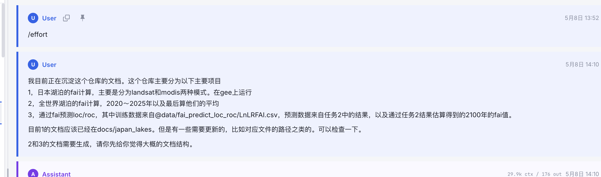

整体session的解析问题可以查看和 @../references/agentsview/中的实现是否一致

#### session信息的解析

现在的实现并不能很好的解析session中的各种信息。比如工具的调用，subagent/task的分配都应该算作一个turn的回复中的。
我觉得可以先检查tests中假设的session样本和实际.claude, .codex中的是否一致。

#### session寻找

我在我们当前实现的程序中貌似找不到这个session，我有几个session是effort开头的，但是下面并没有紧接着的内容

：

   

但是 @../references/agentsview/运行之后是能找到的，并且这个session应该是存在的，请你判明一下原因
