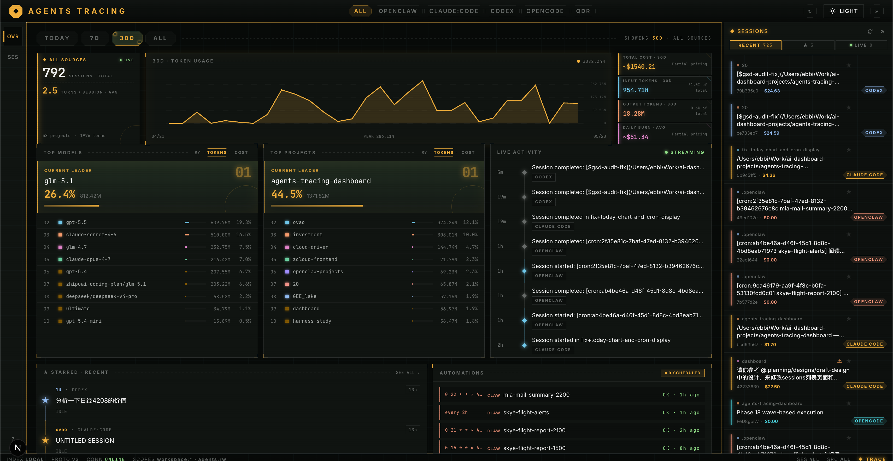
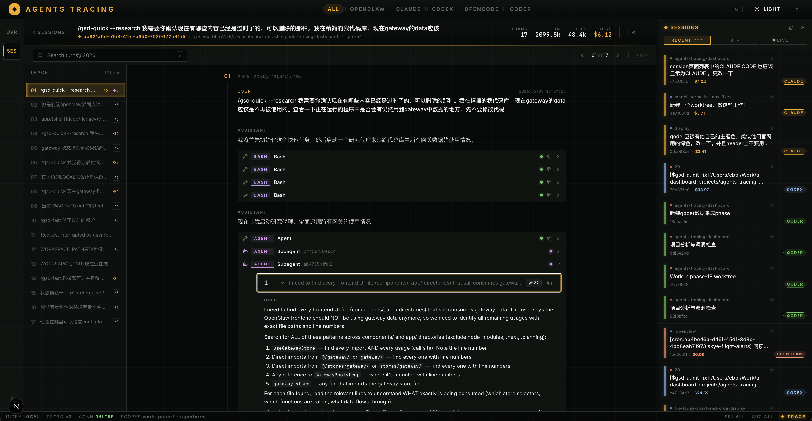

# Agents Tracing Dashboard

**A local dashboard for tracking and replaying AI coding agent sessions — token usage, cost, tool calls, and subagent trees, all in one place.**





---

## What it does

### Usage overview across all your agents

A unified dashboard aggregates token consumption and estimated cost across Claude Code, OpenClaw, Codex, OpenCode, and Qoder — broken down by day, session, project, and model. At a glance you can see:

- Total tokens and estimated USD cost for any time window (today / week / all)
- Per-project and per-model breakdowns with trends over time
- Which sessions consumed the most tokens and where your budget is going
- Live activity feed as new sessions are written to disk

Everything is computed locally from the JSONL files your agents already produce — no account, no upload, no cloud.

### Full session replay with tool and subagent detail

Open any session and step through every turn exactly as it happened. The replay view goes beyond raw text — it surfaces the internal structure of each assistant turn:

- **Tool calls**: expand any `Bash`, `Read`, `Edit`, `Write`, or custom tool invocation to see the exact input arguments and the full output the model received
- **Subagent spawns**: when Claude Code or OpenClaw launches a sub-agent, the dashboard renders the nested agent tree so you can trace which subtask was delegated, what instructions it received, and what it returned
- **Injected context and system events**: surface hidden context blocks, permission prompts, and synthetic messages that normally live between turns but shape how the model behaves
- **Token accounting per turn**: see input, output, cache-read, cache-write, and reasoning token counts at the turn level, not just the session level

---

## Install

### Option 1 — npm (any Node.js 22+)

```bash
npm install -g @camtrik/agents-tracing-dashboard
agents-tracing
```

Update an existing global install:

```bash
npm update -g @camtrik/agents-tracing-dashboard
# Or force the latest published version:
npm install -g @camtrik/agents-tracing-dashboard@latest
```

Works across Node 22, 24, and newer — `npm install` resolves native modules (better-sqlite3) for your local ABI. First install takes ~30s while deps are fetched.

Runtime logs are quiet by default. For verbose diagnostics:

```bash
AGENTS_TRACING_LOG_LEVEL=debug agents-tracing
```

### Option 2 — Docker local build (no Node.js required)

```bash
git clone https://github.com/camtrik/agents-tracing-dashboard.git
cd agents-tracing-dashboard
docker compose up --build
```

The default Compose file builds the app locally with Node 24 inside Docker, so your host machine does not need Node.js installed.

Open [http://localhost:3030](http://localhost:3030).

### Option 3 — Docker published image (no Node.js required)

```bash
docker compose -f docker-compose.image.yml up -d
```

Or run the published image directly:

```bash
docker run --rm -p 127.0.0.1:3030:3030 \
  -v "$HOME/.claude/projects:/agents/claude:ro" \
  -e CLAUDE_PROJECTS_DIR=/agents/claude \
  ghcr.io/camtrik/agents-tracing-dashboard:latest
```

Open [http://localhost:3030](http://localhost:3030). Mount additional agent directories with `-v` and the matching env var (`OPENCLAW_DIR`, `CODEX_SESSIONS_DIR`, `OPENCODE_DB_PATH`).

### Option 4 — from source

```bash
pnpm install
pnpm dev       # starts Next.js (3000) + ingest service (8078)
```

See [`docs/GETTING-STARTED.md`](docs/GETTING-STARTED.md) for full setup and environment variable reference.

---

## Supported agents

| Agent                 | Source files                              | Notes                                     |
| --------------------- | ----------------------------------------- | ----------------------------------------- |
| **Claude Code** | `~/.claude/projects/**/*.jsonl`         | Full tool-call and subagent replay        |
| **OpenClaw**    | `~/.openclaw/agents/*/sessions/*.jsonl` | Gateway live view + file ingest           |
| **Codex**       | `~/.codex/sessions/**/*.jsonl`          | Parent-child session tree                 |
| **OpenCode**    | `~/.local/share/opencode/opencode.db`   | SQLite source                             |
| **Qoder**       | local cache DB                            | Token counts (cost excluded from rollups) |

---

## Privacy

This is a **local-only** tool. No data leaves your machine.

- JSONL files are parsed and indexed into a local SQLite database (`data/ingest.db`).
- The dashboard is read-only — it replays recorded tool calls, never re-executes them.
- No telemetry, no analytics, no cloud sync.

---

## Architecture

Two services, one repo:

| Service                    | Path        | Port                                  | Purpose                                         |
| -------------------------- | ----------- | ------------------------------------- | ----------------------------------------------- |
| **Next.js frontend** | `app/`    | `3030` packaged/Docker; `3000` dev | UI, BFF proxy to ingest                         |
| **Ingest service**   | `ingest/` | `8078`                                | File watcher, JSONL parsers, SQLite, REST + SSE |

For the full data flow and architecture decisions see [`docs/ARCHITECTURE.md`](docs/ARCHITECTURE.md) and [`docs/DATA-FLOW.md`](docs/DATA-FLOW.md).
